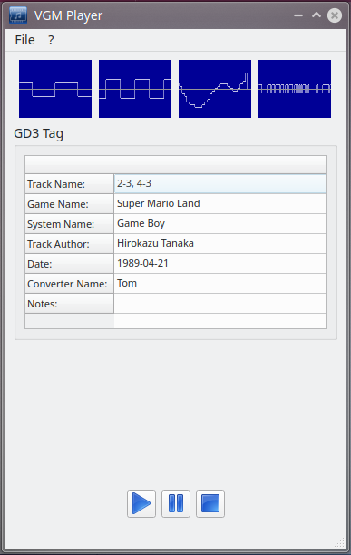

# VGM-Player

### This is a "Video Game Music" player with Qt5.
https://www.vgmusic.com/

### Supports Systems
- Nintendo Game Boy
- Sega Master System / Game Gear

### Other systems will follow.

## Screenshot


## Build under Linux

### Important requirements
- qttools5-dev

### Used libs 
- qt5

### Build and installation
```bash
git clone https://github.com/thkattanek/vgm_player.git
cd vgm_player
git checkout 0.1.0
mkdir build
cd build
qmake .. PREFIX="/usr/local"
make -j8
sudo make install
```
